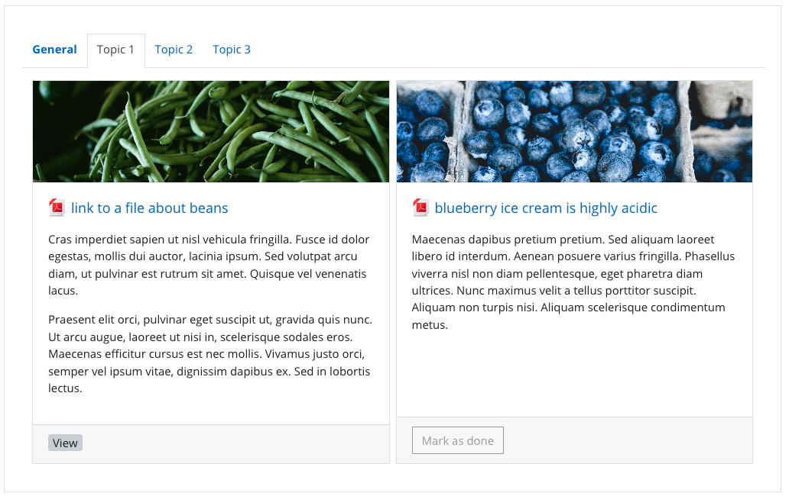
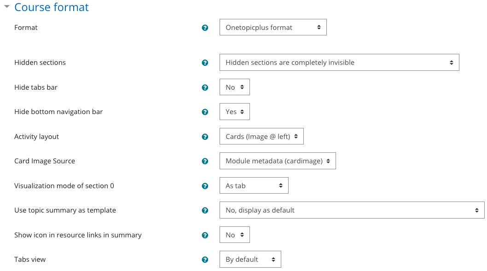
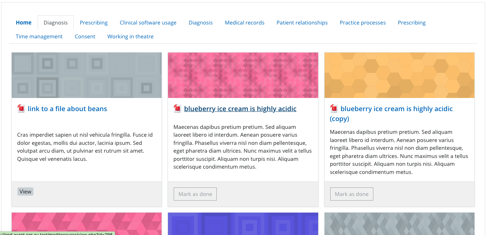
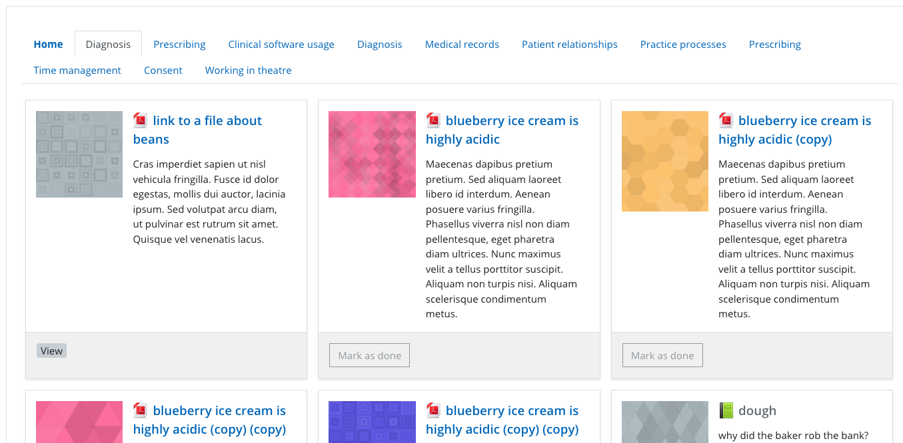
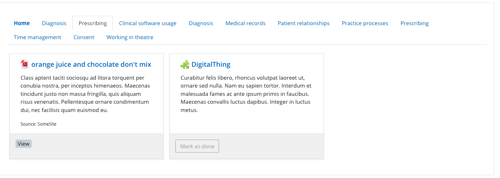

COURSE FORMAT OneTopicPlus
============================

Package tested in: moodle 3.11+.

Moodle 4.0+ not yet supported.

This course format shows Sections as Tabs, and (optionall) Activities within each section as Cards.

QUICK INSTALL
==============
Download zip package, extract the onetopic folder and upload this folder into course/format/.

ACKNOWLEDGEMENTS
=============
This version of OneTopic combines features of both OneTopic and TopicCardActivities with a few additions to both

OneTopic by: David Herney https://github.com/davidherney/moodle-format_onetopicplus

TopicActivityCards by: Andrew Hancox https://github.com/andrewhancox/format_topicsactivitycards

INTEGRATIONS
==========

Custom card images can be extracted from custom fields for activity modules, if installed (https://moodle.org/plugins/local_modcustomfields), if you have a custom field with `shortname` = `cardimage`. The field type can be:

- text - this will render the text directly (maybe your image is externally hosted on imgur.com, or base64 encoded, etc)
- image - using https://github.com/andrewhancox/moodle-customfield_image
- file - using https://github.com/andrewhancox/moodle-customfield_file

Format options:

Cards can have images on the top or on the left or not-at-all. The image source can be extracted from the description field (finds and uses the first image, then removes it from the description) or a randomly generated image can be used.

Images onthe top of the tile (with generated image)

Images on the left of the tile (with generated image)

No image on the tile

### New options

| Name | Purpose |
|----|----|
|Hide tabs bar|You can choose not to have a tabs bar at all|
|Tab bar extra classnames|Tab bar wrapper div classnames (for responsive display etc)|
|Tab bar menu toggle button|Option to have a hamburger menu to hide-show tabs|
|Hide bottom nav bar|Hide next/prev navigation from bottom of activities|
|Show course summary|Show course summary at top of each tab|
|Activity layout|Tile shape (horizontal,vertical)+options or standard activity renderer|
|Card image source|Location to look for card image (when set)|
|Visualisation of seciton 0|Can be a tab or appear above tabs bar|
|Show activity icons in tiles|When rendering activity links to turn off activity icon|
|Starrable|Ability to star an activity (per user)|
|Replacements|Replace customfield values in tile text|
|Show tags|Show tags for this activity, if enabled globally|

VERSION
==========
2020-11-10: Mashed Topic Card Activities into OneTopic. Removed use of external metadata plugin for unsupported fields (duration, card-image). Added formatting options. Add ability to hide bottom section navigation controls. Responsive card layout based on Bootstrap.
2020-12-10: Added stars, hamburger menu, customfield replacement support, activity icon display, tag support.