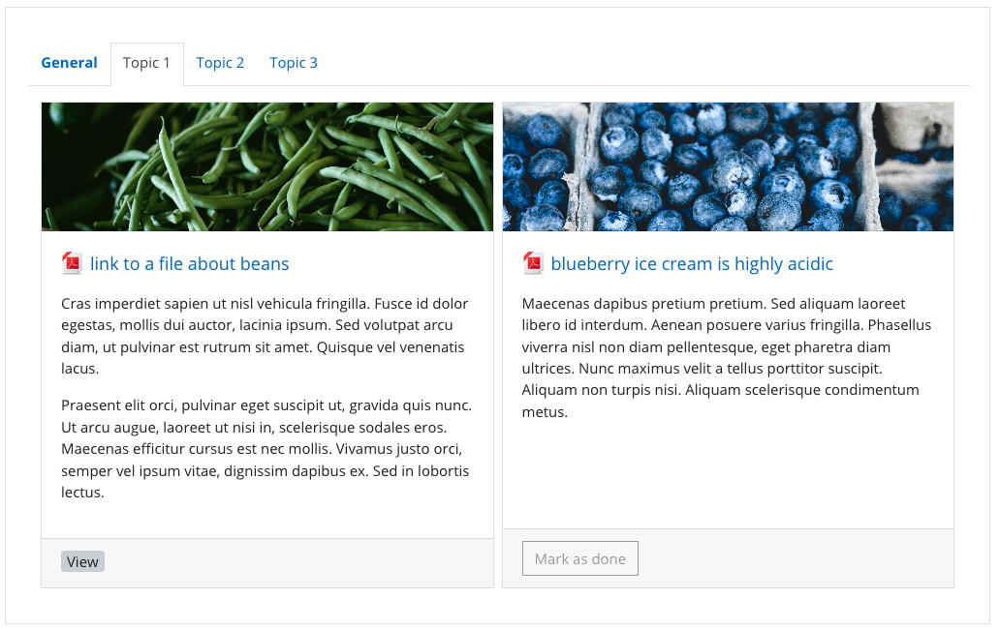

COURSE FORMAT OneTopicPlus
============================

Package tested in: moodle 3.11+.

Moodle 4.0+ not yet supported.

This course format shows Sections as Tabs, and (optionall) Activities within each section as Cards.

(BTW; Labels aren't rendered as Cards, they are left raw).

QUICK INSTALL
==============
Download zip package, extract the onetopic folder and upload this folder into course/format/.

ACKNOWLEDGEMENTS
=============
This version of OneTopic combines features of both OneTopic and TopicCardActivities with a few additions to both

OneTopic by: David Herney https://github.com/davidherney/moodle-format_onetopicplus

TopicActivityCards by: Andrew Hancox https://github.com/andrewhancox/format_topicsactivitycards

VERSION
==========
2020-11-10: Mashed Topic Card Activities into OneTopic. Removed use of external metadata plugin for unsupported fields (duration, card-image). Added formatting options. Add ability to hide bottom section navigation controls. Responsive card layout based on Bootstrap.
